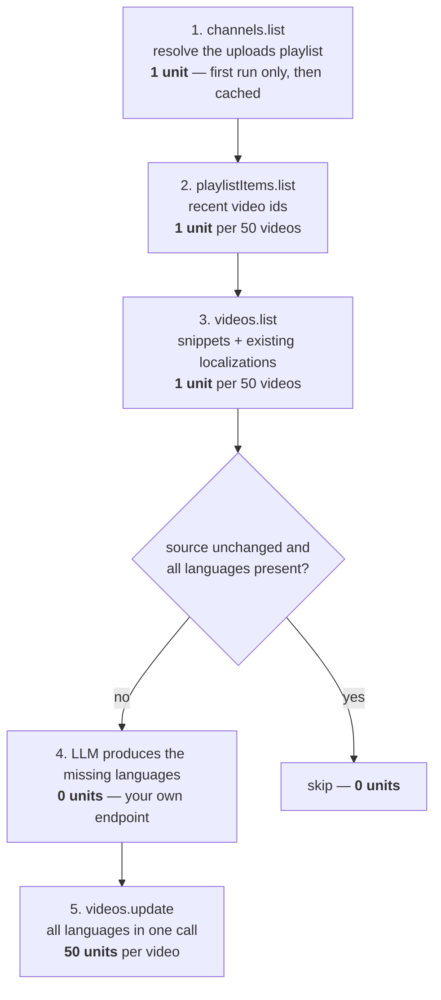

# metaglot

[](https://github.com/ersum00/metaglot/actions/workflows/ci.yml)
[](https://codecov.io/gh/ersum00/metaglot)
[](LICENSE)
[](composer.json)

**metaglot** rewrites your video titles and descriptions in other languages the way native speakers actually **search** — SEO localization, not literal translation — and writes them back through the YouTube Data API v3.

## Why

- Viewers overwhelmingly search in their own language. A video titled only in Turkish effectively does not exist for someone searching in Spanish, Arabic or Japanese — even when it has perfectly good subtitles.
- Every video supports per-language `localizations`. Viewers whose interface language matches one see the localized title and description everywhere: in search results, in suggestions, on the watch page.
- The economics make it worth automating: **one `videos.update` call carries all target languages at once.** Localizing a video into 10 languages costs the same 50 quota units as changing its title once.

Literal translation misses the point. A word-for-word rendering of "İstanbul'da gezilecek yerler" is not what an English speaker types into the search box — *"best things to do in Istanbul"* is. metaglot prompts the LLM for the phrasing a native speaker would search for; [docs/PROMPTING.md](docs/PROMPTING.md) explains how and how to tune it for your niche.

## How it works



Progress lives in your own PostgreSQL. Runs are **idempotent**: when a video's source title/description hash is unchanged and every target language is already present, it is skipped without any API call — so an hourly cron is safe. If the LLM returns only some of the requested languages, the ones that arrived are written and the video stays retryable (`pending`, not `failed`) until the rest are filled in.

## Quota math

| Operation | Cost (units) |
|---|---|
| `videos.update` — all languages in one call | 50 |
| `videos.list` — per batch of 50 videos | 1 |
| `playlistItems.list` — per page of 50 videos | 1 |
| `channels.list` — first run only, then cached | 1 |

| | |
|---|---|
| Effective cost per localized video | **~51 units** |
| Default daily quota | 10,000 units |
| Practical ceiling | **~190 videos/day** |

The quota day resets at midnight **Pacific time**. metaglot meters every call in PostgreSQL before it happens: it warns when a channel reaches 90% of its daily limit and refuses to start any call that would cross 100% — a runaway loop cannot burn your quota.

## Setup

Short version — the full click-by-click walkthrough is in [docs/SETUP.md](docs/SETUP.md).

1. Create a project at [console.cloud.google.com](https://console.cloud.google.com) and enable the **YouTube Data API v3** (APIs & Services → Library).
2. Configure the OAuth consent screen with the `https://www.googleapis.com/auth/youtube.force-ssl` scope — and **publish it ("In production")**, not "Testing". See [pitfall 3](#3-refresh-tokens-die-after-7-days-while-the-consent-screen-is-in-testing).
3. Create an OAuth client ID (type: Desktop app) and note the client ID and client secret.
4. Obtain a refresh token for the channel's Google account ([docs/SETUP.md](docs/SETUP.md#5-obtain-a-refresh-token) has the exact commands).
5. Install and register the channel:

```sh
git clone https://github.com/ersum00/metaglot.git && cd metaglot
composer install
psql -d <database> -f migrations/001_initial.sql
cp .env.example .env   # then fill in database + LLM settings
```

```sql
INSERT INTO channels (label, refresh_token, client_id, client_secret, source_lang, target_langs)
VALUES ('my-channel', '<refresh-token>', '<client-id>', '<client-secret>',
        'tr', '{en,es,ar,de,fr,pt,hi,id,ja,ru}');
```

## Usage

Always start with a dry run — it prints every title it would write without touching anything:

```sh
php bin/metaglot --channel=1 --dry-run
```

When the output looks right:

```sh
php bin/metaglot --channel=1   # one channel
php bin/metaglot --all         # every active channel
```

Because runs are idempotent, the natural deployment is an hourly cron:

```cron
0 * * * * cd /opt/metaglot && php bin/metaglot --all >> /var/log/metaglot.log 2>&1
```

To remove a channel and everything stored about it (see [Compliance](#compliance)):

```sh
php bin/metaglot channel:delete --channel=1          # shows what would be removed
php bin/metaglot channel:delete --channel=1 --force  # actually deletes
```

## Translation provider

The default is a **local [Ollama](https://ollama.com)** — video metadata is processed on your own machine:

```sh
ollama pull qwen2.5:14b-instruct
```

With Ollama running, metaglot works with no LLM configuration at all (default endpoint `http://127.0.0.1:11434/v1/chat/completions`).

Any **OpenAI-compatible** chat completions endpoint works instead — set three environment variables:

```sh
LLM_ENDPOINT=https://api.openai.com/v1/chat/completions
LLM_MODEL=gpt-4o-mini
LLM_KEY=<your key>
```

## Known pitfalls

Three things about the YouTube Data API that are easy to get wrong, cost real data, and produce no error message. metaglot handles all three — they are documented here because you will hit them if you modify the code or write your own tooling.

### 1. A partial snippet update *deletes* fields

`videos.update` with `part=snippet` **replaces the entire snippet** — it is not a patch. Any field you leave out of the request is not "left unchanged"; it is removed from the video. Send a snippet without `tags` and every tag on the video is silently deleted. Leave out `categoryId` and the update breaks.

metaglot therefore always fetches the current snippet first and sends it back **complete** — title, description, `categoryId`, `tags` and `defaultLanguage` — with only the localizations added. This behavior is regression-tested; if you fork this code, keep those tests green.

### 2. `defaultLanguage` must be set — or localizations are silently ignored

If a video has no `defaultLanguage`, YouTube does not know what language the original title is in — and the `localizations` you send are **silently ignored**. The API returns 200, nothing is stored, no error, no warning. This is the single most confusing failure mode: everything looks fine and nothing shows up.

metaglot fills an empty `defaultLanguage` with the channel's configured `source_lang` in the same update call, so localizations always take effect.

### 3. Refresh tokens die after 7 days while the consent screen is in "Testing"

A Google Cloud OAuth consent screen starts in **"Testing"** mode, and refresh tokens issued by a testing-mode app **expire after 7 days**. The tool works all week, then suddenly every request fails with `invalid_grant` and the channel owner has to re-authorize.

The fix is one click: publish the consent screen to **"In production"** (APIs & Services → OAuth consent screen → Publish app). Google will show an "unverified app" warning during authorization — for a tool you run against your own channels that is acceptable, and the refresh token then lives until it is revoked. When metaglot hits `invalid_grant`, its error message explains exactly this.

## Compliance

metaglot is a self-hosted tool. **Whoever runs it is the "API Client" under the [YouTube API Services Terms of Service](https://developers.google.com/youtube/terms/api-services-terms-of-service) and bears the responsibility for complying with them**, including the [Developer Policies](https://developers.google.com/youtube/terms/developer-policies). Data obtained through Google APIs is also subject to the [Google Privacy Policy](https://policies.google.com/privacy).

What metaglot stores, and where:

| Data | Where it lives |
|---|---|
| Channel id, uploads playlist id, label | Your own PostgreSQL |
| Video ids, titles, publish dates, processing state | Your own PostgreSQL |
| OAuth refresh token, client id, client secret | Your own PostgreSQL |
| Quota usage log | Your own PostgreSQL |

Nothing is sent to any third party: requests go only to Google's APIs and to the LLM endpoint **you** configure. With the default local Ollama, titles and descriptions are processed entirely on your own machine.

To delete everything stored about a channel — including its OAuth tokens — run:

```sh
php bin/metaglot channel:delete --channel=<id> --force
```

The deletion cascades: videos and quota history go with the channel row.

## Contributing

Bug reports and pull requests are welcome — see [CONTRIBUTING.md](CONTRIBUTING.md) for the development setup, test suite and style rules. Notable changes are tracked in [CHANGELOG.md](CHANGELOG.md).

## License

[MIT](LICENSE).
